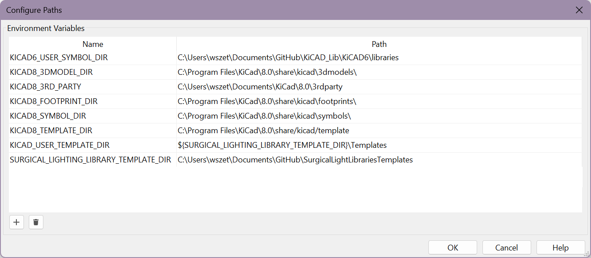

# Template Usage: 

Open KiCAD, go to Preferences -> Configure Paths

Add a path named `SURGICAL_LIGHTING_LIBRARY_TEMPLATE_DIR` and edit the path to be in the root of this Github Repository.

For the path named `KICAD_USER_TEMPLATE_DIR` edit the path to be `${SURGICAL_LIGHTING_LIBRARY_TEMPLATE_DIR}\Templates`. 

When this is all done, you should be able to do File -> New project from Template, Select User Templates, and see one named "JLC 2 Layer Template". This is the suggested template for us to use.  

Example of Path Configuration